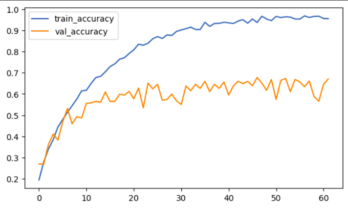

<h1 align='center'>Image Classification Model Challenge</h1>

In this project the challenge was to built a image classifier model and gain as much accuracy as possible without using any popluar architecture or augmentation.

## Data

Popular Cifar10 dataset was used for this project. The CIFAR-10 dataset consists of 60000 32x32 colour images in 10 classes, with 6000 images per class. There are 50000 training images and 10000 test images.

## Tools
TensofFlow, Keras, OpenCV, NumPy, Pandas, Matplotlib, Kaggle

## Challenges: 
- 5000 images were taken for both training set and validation set from randomly shuffled indeces, test sample remained untouched
- Making a simple model from scratch, without following any popular architecture (eg. VGGNet, ResNet, DenseNet etc.) 
- Do not use any data augmentation
- Achieve as much accuracy as possible without using any data augmentation technique, changing the training sets. Can only change the models architecture, shuffling the layers and changing the parameters of the layers.

## Result & Conclusion:

The model was refined by steadily enhancing its performance by adjusting layers and fine-tuning parameters at every step. Through this, the models accuracy was improved from 53.36% to 66.7%. As a simple model it is a remarkable improvement especially when I had virtually no controll over the data splits.

Current model achieved maximum training accuracy of 95.96% and validation accuracy of 66.7%. The model is clearly overfitting. One obvious cause is the splitting of the dataset was not controlled. 

**Note:** Training set and validation set was created from randomly generated indeces. This was intentional to create a scenario mimicing real world data, where we cannot always ensure equal distribution of data for each class.

## Future Plan:
We can comapre the models performance after training it on a controlled split of the given dataset. Also we can use data augmentation and other optimization methods to see how they affect the models performance.
